# Lab 1 - Thiết kế Resource cho Blog API

## 1. Xác định Resources trong miền

| RESOURCE | MÔ TẢ |
|---|---|
| `users` | Người dùng của hệ thống |
| `profiles` | Hồ sơ của người dùng |
| `posts` | Bài viết trên blog |
| `comments` | Bình luận trên bài viết |
| `tags` | Thẻ gắn cho bài viết |
| `follows` | Quan hệ theo dõi giữa người dùng |

## 2. Phân loại Collection / Item / Sub-resource

| LOẠI | ENDPOINT | MÔ TẢ |
|---|---|---|
| Collection | `/users` | Tập hợp người dùng |
| Item | `/users/{id}` | Một người dùng cụ thể |
| Sub-resource | `/users/{id}/profile` | Hồ sơ của một người dùng |
| Sub-resource | `/users/{id}/posts` | Các bài viết của một người dùng |
| Sub-resource | `/users/{id}/followers` | Những người theo dõi một người dùng |
| Sub-resource | `/users/{id}/following` | Những người dùng mà một người đang theo dõi |
| Collection | `/posts` | Tập hợp bài viết |
| Item | `/posts/{id}` | Một bài viết cụ thể |
| Sub-resource | `/posts/{id}/comments` | Các bình luận của một bài viết |
| Sub-resource | `/posts/{id}/tags` | Các thẻ của một bài viết |
| Item | `/tags/{slug}` | Một thẻ cụ thể |
| Sub-resource | `/tags/{slug}/posts` | Các bài viết thuộc một thẻ |

### Quy ước

- **Collection**: đại diện cho một tập hợp tài nguyên, sử dụng dạng số nhiều.
- **Item**: đại diện cho một tài nguyên cụ thể, được xác định bằng `{id}` hoặc `{slug}`.
- **Sub-resource**: biểu diễn quan hệ cha-con giữa các tài nguyên.
- Độ sâu của endpoint được giữ ở mức tối đa 3 cấp để đảm bảo dễ đọc và dễ quản lý.

## 3. Sơ đồ cây endpoint và quyết định version segment
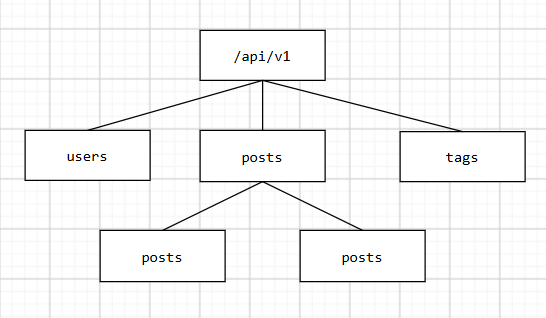

## 4. Triển khai Flask routes cho collection /posts
### 4.1 Chạy server:
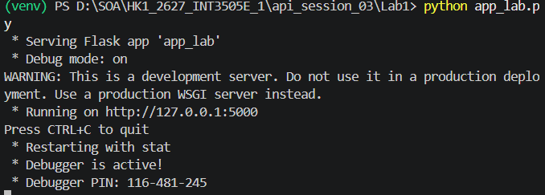

### 4.2 GET danh sách các posts:
Status code trả về:
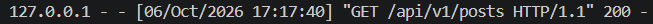
Kết quả
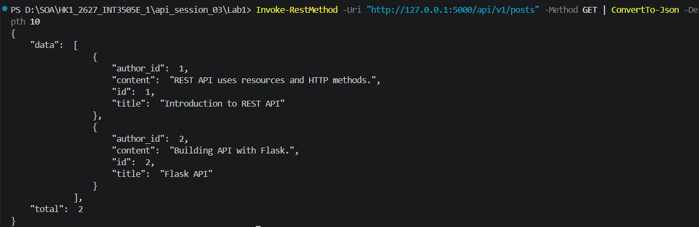

### 4.3 POST tạo bài viết thành công:
Status code trả về:
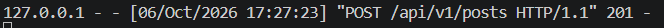
Kết quả
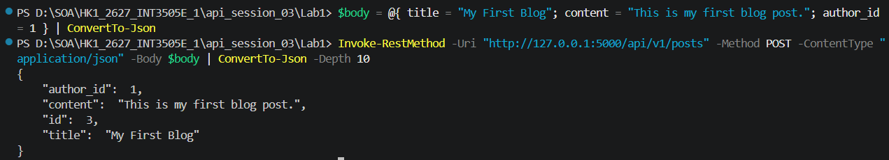

### 4.4 POST thiếu title:
Status code trả về:
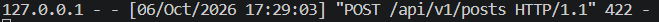
Kết quả thiếu tile:
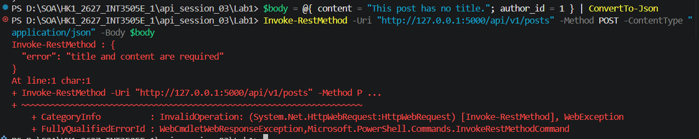
Kết quả thiếu content:
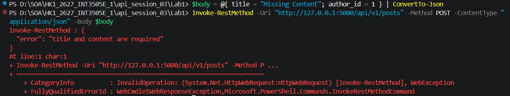

### 4.5 POST không có Content-Type:
Status code trả về:
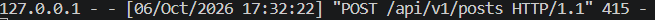
Kết quả
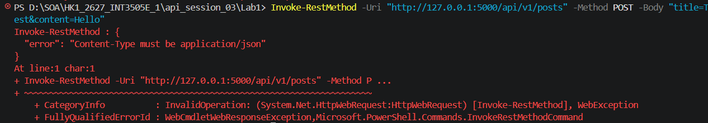

### 4.6 POST JSON không hợp lệ:
Kết quả
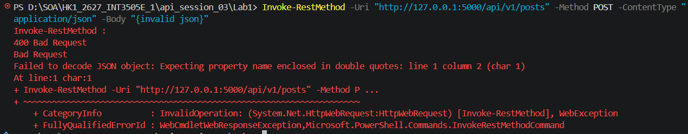

