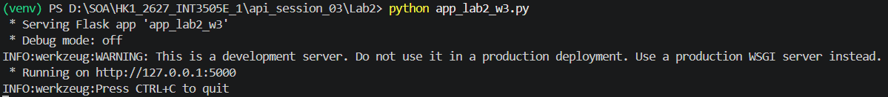
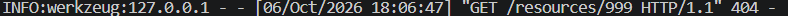
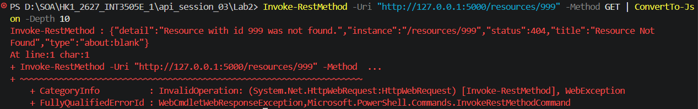
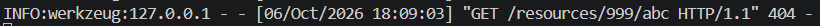
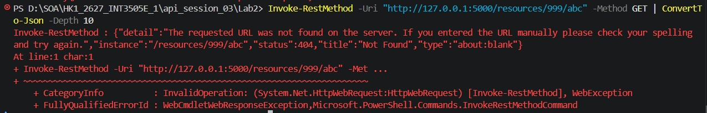
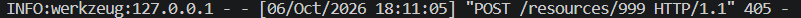
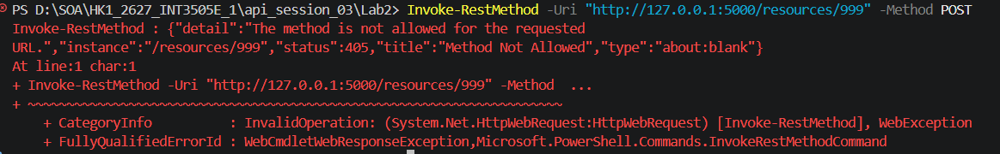
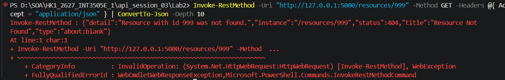
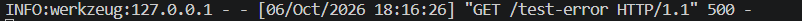
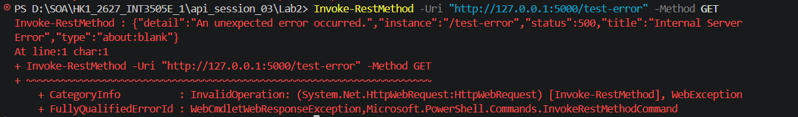

# Lab 2 - Error handler trả về problem+json

## 1. Chạy server:

## 2. 404 — /resources/{id}:
Status code trả về:

Kết quả

## 3. HTTPException — route không tồn tại:
Status code trả về:

Kết quả

## 4. 405 — HTTP method không được phép:
Status code trả về:

Kết quả

## 5. Không có/Có Accept:
Status code trả về:

Kết quả không có Accept

Kết quả có Accept

## 7. Exception chưa được bắt — 500:
Status code trả về:

Kết quả:

