# Lab 3 - Triển khai /orders có cursor pagination

## 1. Chạy server:
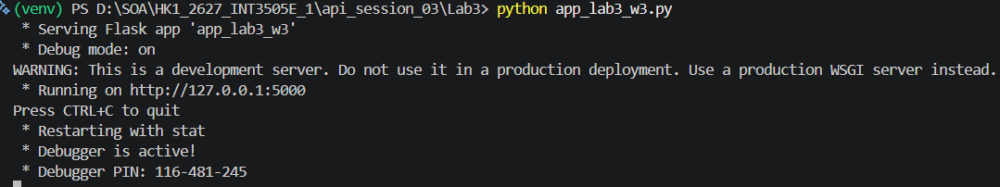

## 2. Filter status:
Status code trả về:
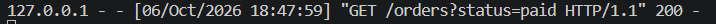
Kết quả
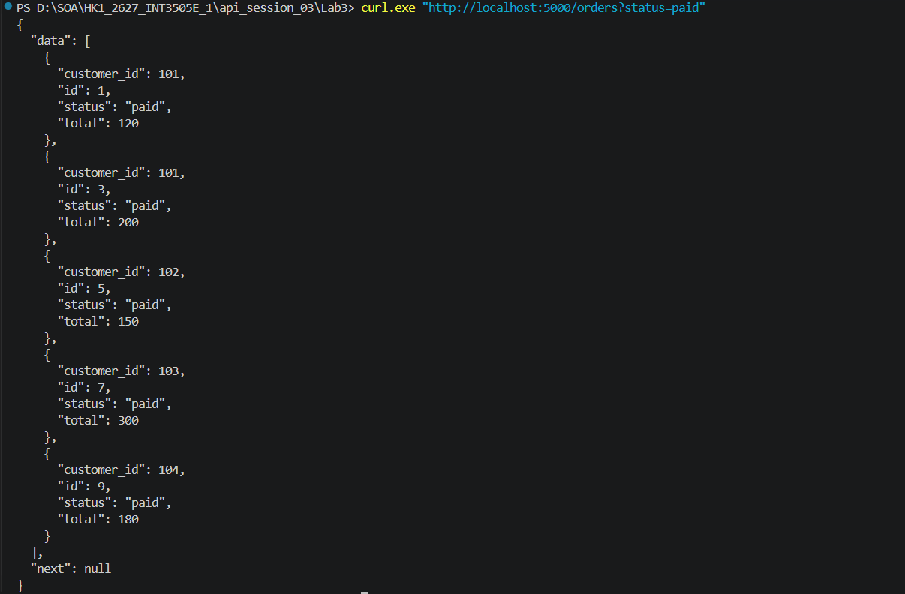

## 3. Cursor pagination với limit:
Status code trả về:
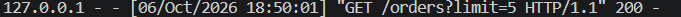
Kết quả
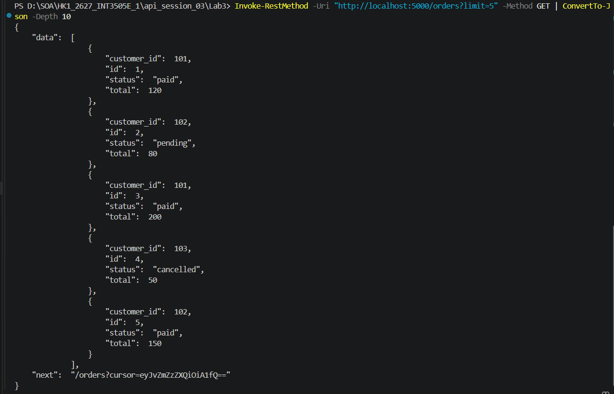
Khi lấy trang tiếp theo, status code trả về:
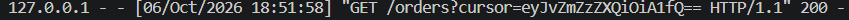
Kết quả trang tiếp theo:
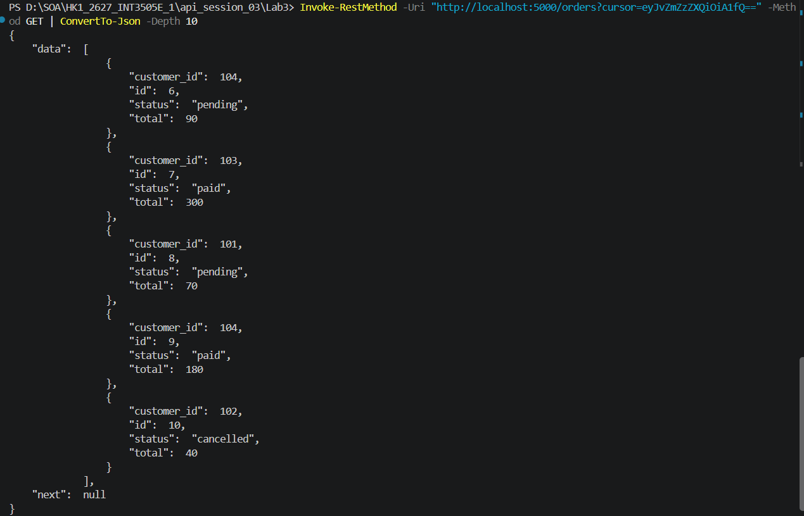

## 4. Sparse fieldsets:
Status code trả về:
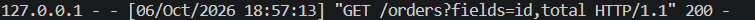
Kết quả:
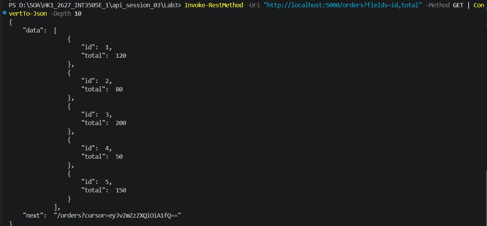

## 5. Test customer_id:
Status code trả về:
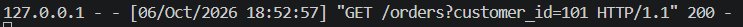
Kết quả:
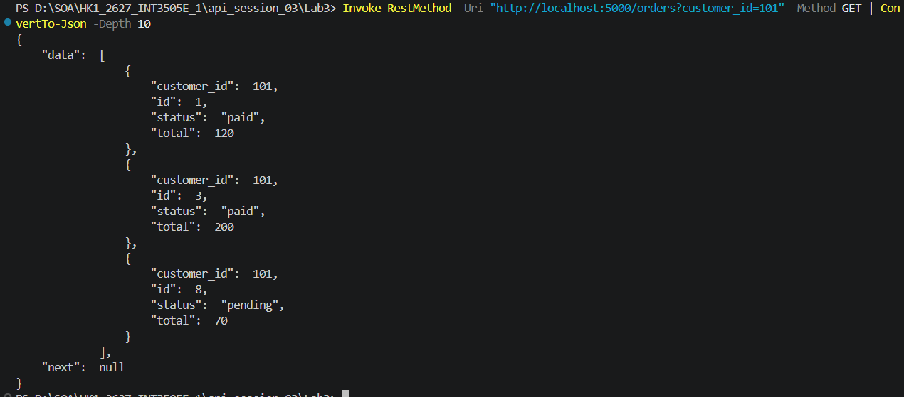

## 6. Sort:
Status code trả về:
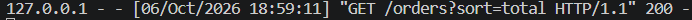
Kết quả sort tăng dần:
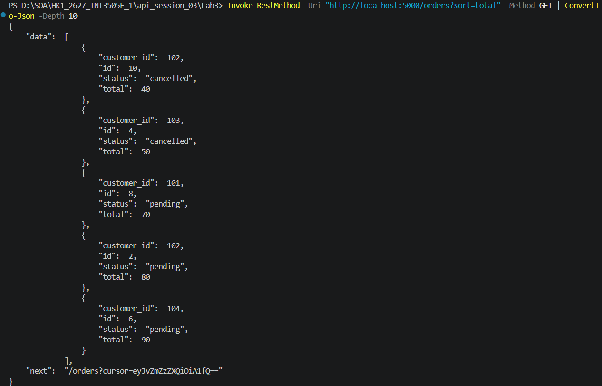
Status code trả về:
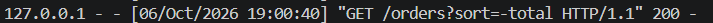
Kết quả sort giảm dần:

## 7. Lỗi cursor:
Status code trả về:
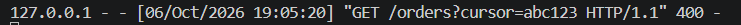
Kết quả:
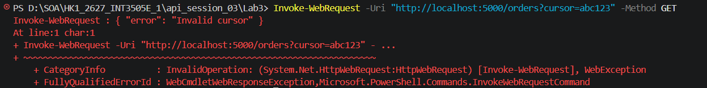

## 8. Field không tồn tại:
Status code trả về:
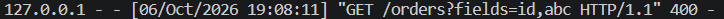
Kết quả:
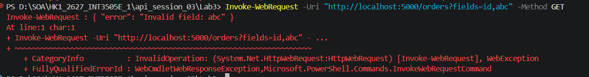
